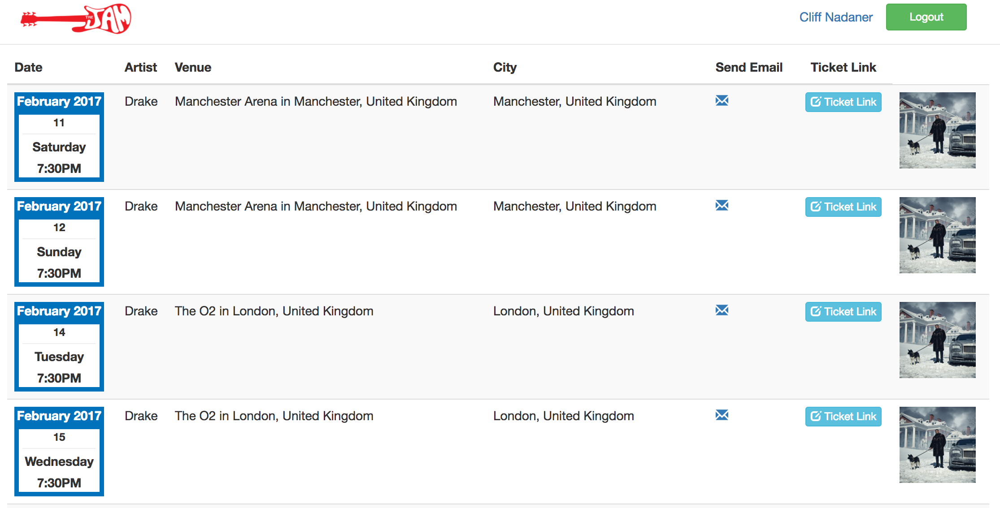

# Jam-City



Music application that enables a user to login in using Spotify Oauth. Upon login, the user will be able to view their top played artists and songs. They will also be able to see, depending on their location, their top artists concert. There is also search functionality if none of your artists have concerts in your area.


### Installing

```
git clone git@github.com:antciccone/jam.git
bundle install
```
You will then need to register for a Spotify api key. Once you have a Spotify api key...

```
figaro install
```

Put you api key in your application.yml file

## Running the tests

```
rspec
```

## Technical Details
* Ruby version: 2.3.1
* Rails version: Rails 5.0.1

* Languages
  * HTML, CSS, Javascript, Ruby

* Frameworks/libraries
 * jQuery, Bootstrap, Rails

* Testing
 * TDD, Rspec, Capybara

* API's Used
 * Spotify
 * Sendgrid
 * Google Maps
 * Bands In Town

* Other
  * Spotify Oauth
  * PostgreSQL
